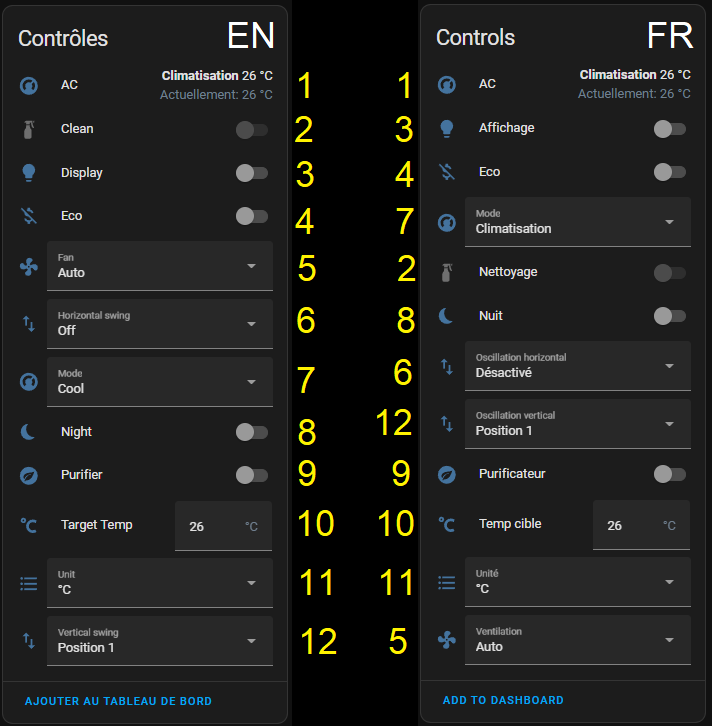
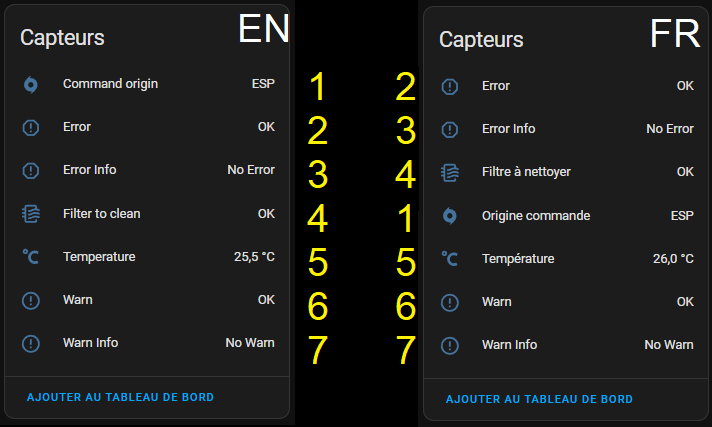
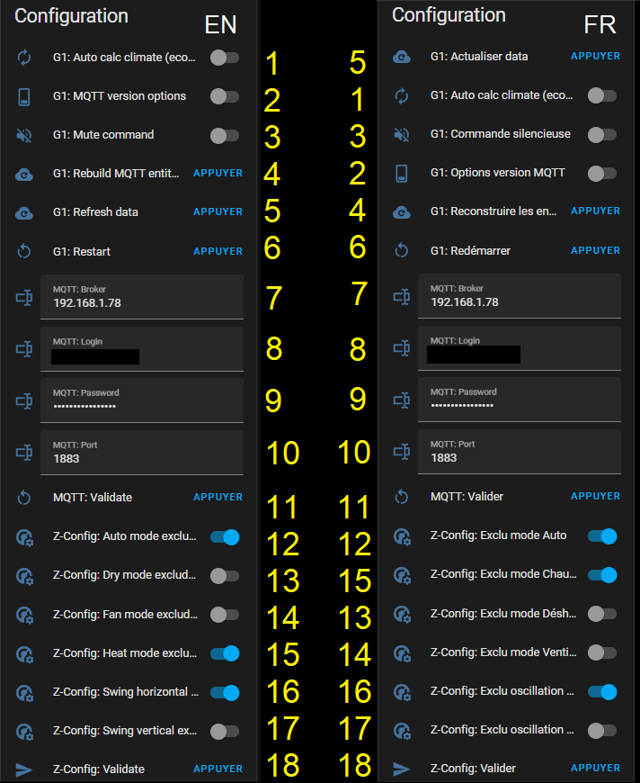
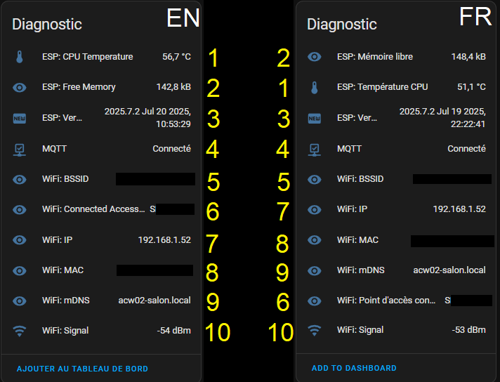
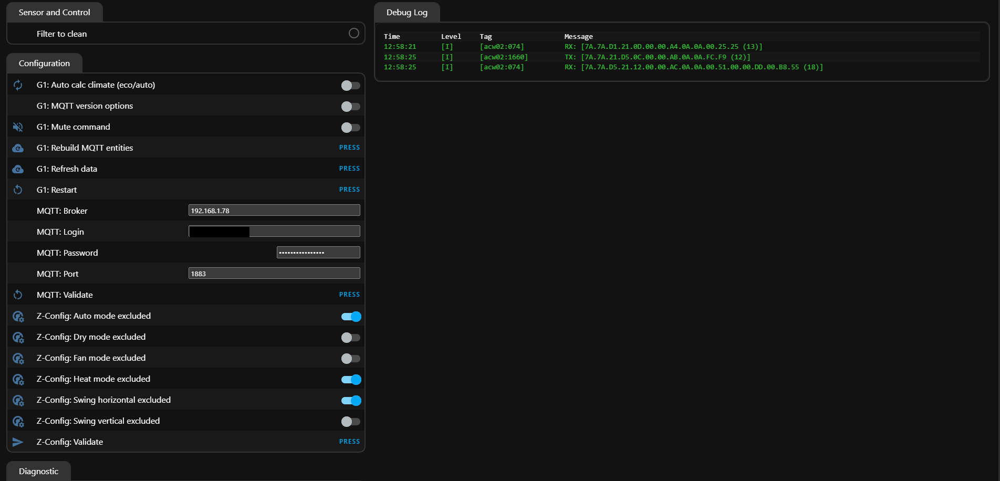
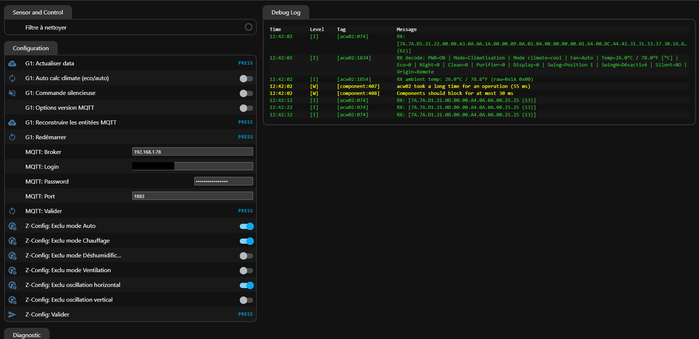
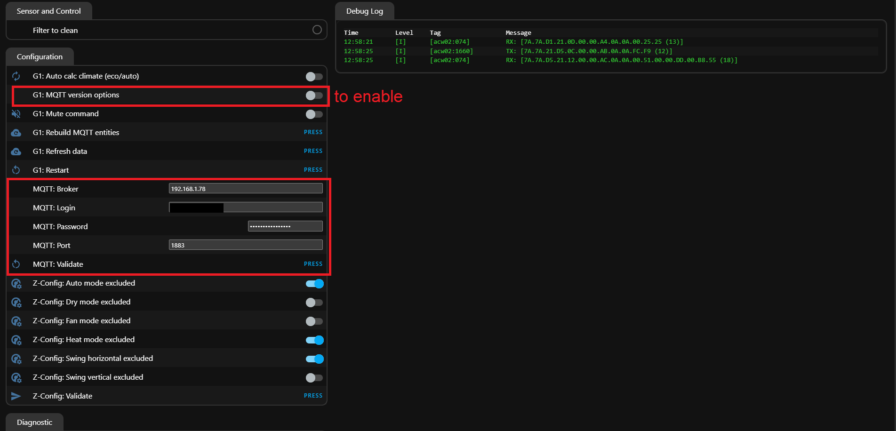

# 🔍 Interface Details

## 🎛️ Controls



| #  | Description |
|---:|-------------|
| 1  | Climate (configured in section below) |
| 2  | Clean option — available when AC is off |
| 3  | Display option |
| 4  | Eco option — available when mode is "cool" and AC is on |
| 5  | Fan speed — available when AC is on and eco is off |
| 6  | Horizontal swing (select) |
| 7  | AC mode (select) |
| 8  | Night mode — available when mode is cool/dry/heat and AC is on |
| 9  | Purifier — available when AC is on |
| 10 | Target temperature — unavailable when eco is on or mode is auto |
| 11 | Temperature unit (°C or °F) (select) |
| 12 | Vertical swing (select) |

---

## 📡 Sensors



| #  | Description |
|---:|-------------|
| 1  | Source of last command — Whether the last command came from the ESP or the remote |
| 2  | AC error detected |
| 3  | AC error info |
| 4  | Filter status — Indicates whether cleaning is needed (`OK` if everything is fine) |
| 5  | Ambient temperature — The current temperature reported by the AC |
| 6  | AC warn detected |
| 7  | AC warn info |

---

## ⚙️ Configuration




| #  | Description |
|---:|-------------|
| 1  | Destroy and recreate the Climate entity to reflect options like eco |
| 2  | Enable MQTT version of G1 command (useful if not using ESPHome integration in Home Assistant) |
| 3  | Mute all commands sent from ESP to the AC (except for clean action) |
| 4  | Destroy and recreate all MQTT entities |
| 5  | Request status update from AC |
| 6  | Restart the ESP |
| 7  | MQTT IP (auto-saved; the validate button only restarts the ESP) |
| 8  | MQTT username (auto-saved; the validate button only restarts the ESP) |
| 9  | MQTT password (auto-saved; the validate button only restarts the ESP) |
| 10 | MQTT port (auto-saved; the validate button only restarts the ESP) |
| 11 | Restart ESP to apply MQTT access changes |
| 12 | Disable "Auto" mode (auto-saved; validate button will recreate MQTT entities) |
| 13 | Disable "Dry" mode (auto-saved; validate button will recreate MQTT entities) |
| 14 | Disable "Fan only" mode (auto-saved; validate button will recreate MQTT entities) |
| 15 | Disable "Heat" mode (auto-saved; validate button will recreate MQTT entities) |
| 16 | Disable horizontal swing (auto-saved; validate button will recreate MQTT entities) |
| 17 | Disable vertical swing (auto-saved; validate button will recreate MQTT entities) |
| 18 | Manually recreate MQTT entities (to apply disable settings) |
| A  | option for reset or not eco/purifier when ac is turn off |

---

## 🧪 Diagnostics



| #  | Description |
|---:|-------------|
| 1  | ESP internal temperature |
| 2  | Free memory |
| 3  | ESPHome build version |
| 4  | MQTT connection status |
| 5  | Wi-Fi BSSID |
| 6  | Wi-Fi AP name |
| 7  | Wi-Fi IP address |
| 8  | Wi-Fi MAC address |
| 9  | Local domain name for ESP web access |
| 10 | Wi-Fi signal quality |

---

## 🌐 Web Interface (example access: http://acw02-salon.local/)

### English



### French




## 🧩 Optional: MQTT Only Without ESPHome HA Integration

### 📄 In `yaml`

Remove from the `substitutions` section:

```yaml
api_encrypted_key: "D2oldc0VP++fni6src89tCSC0UwBhNPgyc8vgYN8/mA="
```

Remove the entire `api` section:


~~api:~~  
&nbsp;&nbsp;~~encryption:~~  
&nbsp;&nbsp;&nbsp;&nbsp;~~key: ${api_encrypted_key}~~  
&nbsp;&nbsp;~~reboot_timeout: 0s # in test to avoid forcing ESPHome native integration~~

---

After connecting the climate entity, open the web interface (example: [http://acw02-salon.local/](http://acw02-salon.local/)) and configure it like this:


